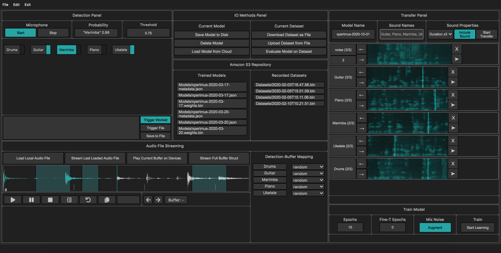

# Sttera
**A Software for Audio Recognition and Orchestration as Medium for Music Ritual**



This repository belongs to an academic research encompassing music ritual, musicking, and digital interfaces as performance mediators. To help the user setup the platform and its code in a simple way, two tutorials are provided here: 1) play audio (through microphone detection) on several devices in a local network; and 2) train a custom audio detection model.

## Setup and Dependencies

Git clone this repository to a folder in your machine and install the dependencies. This is web project composed of a python Flask server and the front-end. 

```
git clone https://github.com/luisArandas/xperimus.git
python3 -m venv xpenv && source xpenv/bin/activate
pip3 install -r requirements.txt
```

Some of the dependencies are not really used (e.g. `passlib`) and yet they are kept here as they come from some of the needs from the beginning of the research (e.g. how to store multiple server instances in a postgres database). The project is interconnected with Heroku through hooks so you can find a Procfile to build your own personal server, as well as with Amazon AWS S3 (currently unused and with the code commented out for future use).

The interface is calibrated for 15,4-inch (2880 x 1800) browser displays but it has also been tested in 27-inch and it adapts the containers so no overlapping happens. Regarding the network, the example in this readme is not with Heroku but with a local server but it should be straightforward to adapt to other services. 

## Play custom audio in connected interfaces

After activating the virtual environment the user can run the project through the command `python3 app.js` and subsequently access the browser through `http://localhost:5000/`.

If you open Sttera in a normal browser window it will start with the interface shown in picture 1, a **controller** if I may. This is where you have all the functionalities. 

To get straight to what we want to do we can skip some of the parts of the interface. Each Sttera instance can have several "rooms" where several devices can connect, but here we will focus on just one. The steps are: 

1) **create a room where several devices can connect**

When in Sttera's main page press 1 to jump to a new page with a code editor and some buttons. On the `Current Room` container write a new room name e.g. "jardim" and click `Lock`

2) **create a virtual device (another browser on the same network) which will receive impulses and play audio** 

To simulate a mobile phone just connect to the localhost with a browser resized to the minimum width possible and it will run as a mobile phone. Here the interface will be a bit different and much more simple with a small text input in the top where you will write "jardim" and click connect. (If you check the main Sttera instance, you will see that you have now 1 user in the room).

3) **upload and stream an arbitrary audio file**

Go back to the original interface by clicking 1 and in the audio editor panel choose `Play Current Buffer on Devices` so you can see a white flickr display in the virtual mobile phone. That signals when the buffer is meant to be played from a successful detection. Now to upload a buffer click `Load Local Audio File` that will popup a dialog to your native file system. It will be loaded and displayed in the interface and you can stream it to the connected device(s) by clicking `Stream Last Loaded Audio File`. This will make a blue rectangle appear in the mobile phone so you know that at least one buffer is loaded for them to play. 

4) use the microphone detection system with a pre-trained model so it can play the files on the connected devices when a detection is successful.

After this you can make a little test with a pre-loaded model - from the SpeechCommands dataset - and test with some words if it detects what you are saying (here the voice is just an example of a sound source with a specific model). Click `Start` from the Detection Panel and the labels of the model will appear. You can choose for example "one" or "yes" and click the button right beside the label so when that is detected by the microphone the system knows that it is supposed to be streamed. You also need to click the button `Trigger File` so the system knows it is the buffer and not a custom audio engine. From here you will notice - if the model detects - that you can play audio in the connected users through audio flowing through the microfone. You will also notice that a sine in the background will play and that means that you can also trigger the AudioWorklet and make your own DSP to play in the ritual. 

## Train a model to recognize audio

It is also possible to train a model in the front-end given the current advances of `tensorflow.js`. In the Tranfer Panel the user can make transfer learning on top of the SpeechComands model by defining the name (currently xperimus-year-month-day), add the labels separated by ",", and specify the duration. It is also possible to "include sound" so the user can listen to the recordings. After this is defined you can click `Start Transfer`. This will popup an interface for the various labels and at least 3 examples of each is needed to add, including background noise (the user should erase the "1[sec]" to an integer that corresponds to seconds). After that we can tweak the Train Model panel with e.g. augment the dataset with noise or specify the epochs and start transfer. After it is done (some seconds) it is possible to do exactly the same tutorial but with a custom model that will appear in the Detection Panel after the microphone is instantiated. 

*warning: some of the features may not be 100% correlated with the interface for this is a research project and not specifically ready to large scale production*

## Acknowledgements

© Luís Arandas and Rui Penha 2020/2021

The research leading to these results was financially supported by the Portuguese Foundation for Science and Technology (FCT) through an individual doctoral research grant, and by the project “Experimentation in music in Portuguese culture: History, contexts and practices in the 20th and 21st centuries” (POCI-01-0145- FEDER-031380) co-funded by the European Union through the Operational Program Competitiveness and Internationalization, in its ERDF component, and by national funds, through the FCT.
